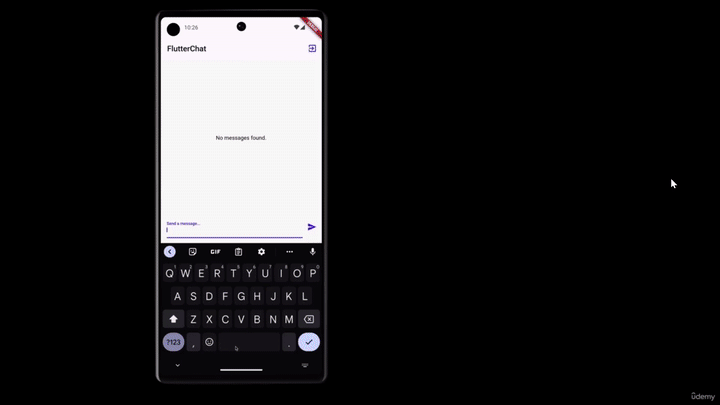

This repository contains the source code for a chat mobile app that utilizes **Firebase** services for **Authentication**, **Storage**, **Realtime Database**, and **Messaging** (Push Notifications).

## Features

- **User Authentication:** Firebase Authentication is used to securely manage user sign-up and login.
- **Realtime Messaging:** Users can send and receive messages in real-time.
- **User Profiles:** Users can create and update their profiles, including their profile picture.
- **Push Notifications:** Firebase Cloud Messaging (FCM) is used to send push notifications for new messages.

## Prerequisites

A Firebase project with Authentication, Realtime Database, Storage, and Cloud Messaging set up. You can create one on the [Firebase Console](https://console.firebase.google.com/).

## Setup

Replace the API key and secret with your Firebase project's configuration values.

## Contributing

If you'd like to contribute to this project, please follow these steps:

1. Fork this repository.
2. Create a new branch for your feature or bug fix: `git checkout -b feature/new-feature`.
3. Make your changes and commit them: `git commit -m 'Add new feature'`.
4. Push to your forked repository: `git push origin feature/new-feature`.
5. Create a pull request on the original repository.

## Acknowledgments
Thanks to Firebase for providing a robust backend infrastructure.
This project was created as a learning exercise and is not meant for production use.

##
Happy chatting! If you encounter any issues or have questions, please feel free to open an issue in this repository.
